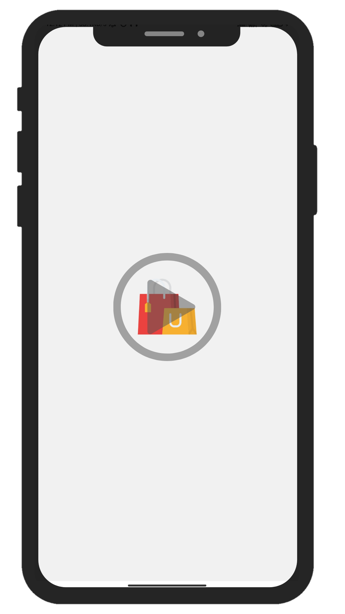

<div align="center">
  
  <h1>Shoe Store for Android</h1>
  <p>A mobile-commerce prototype with a local product catalog, persistent cart, Firebase authentication, and Material navigation.</p>

  <p>
    
    
    
    
    
  </p>

  <p>
    <a href="https://drive.google.com/file/d/1jRR6ZE6aVhxAqMWE9D153fUA0LFN8h8d/view?usp=sharing"><strong>Download APK</strong></a>
    ·
    <a href="https://drive.google.com/file/d/1ubCtlsfgMRLsH22R2HK0kbZB3ZoA4HcP/view?usp=sharing">Watch demo</a>
  </p>
</div>

## Overview

Shoe Store explores the core interaction model of a native Android shopping application: browse category-backed inventory, inspect product details, adjust quantities, keep a cart across sessions, and move between commerce surfaces through a custom bottom navigation experience.

<p align="center">
  <a href="https://drive.google.com/file/d/1ubCtlsfgMRLsH22R2HK0kbZB3ZoA4HcP/view?usp=sharing">
    
  </a>
</p>

## What is implemented

| Area | Implementation |
| --- | --- |
| Product catalog | Room entities and DAOs for categories and items |
| Product discovery | RecyclerView cards, category filters, banners, and a detail bottom sheet |
| Cart | Quantity controls with Gson-backed SharedPreferences persistence |
| Session | Firebase Authentication and a local session manager |
| Navigation | Home, search, cart, favorites, and profile destinations |
| UI | XML layouts, View Binding, Data Binding, Glide, and Material components |

## Architecture

```text
Activities and fragments
        ↓
Adapters + View/Data Binding
        ↓
Room catalog        SharedPreferences cart
        ↘             ↙
          Commerce UI
        ↗             ↖
Firebase Auth       Local session state
```

## Local setup

### Requirements

- Android Studio with an Android SDK compatible with compile SDK 34
- A Firebase Android project with Authentication configured

### Configure and run

1. Clone the repository:

   ```bash
   git clone https://github.com/rahultripathi17/shoe-store-android.git
   ```

2. Register the Android package `com.project.stacklab` in your Firebase project.
3. Download your own `google-services.json` and place it in `app/`.
4. Open the project in Android Studio, sync Gradle, and run the `app` configuration.

Firebase configuration is deliberately excluded from version control.

> [!NOTE]
> This repository is a portfolio prototype. Authentication and checkout-related flows require production hardening before real customer or payment use.

## Repository layout

```text
app/src/main/java/com/project/stacklab/
├── Activities/       # entry, authentication and host screens
├── Fragments/        # store destinations and product interactions
├── Adapters/         # RecyclerView and pager adapters
├── Database/         # Room database and DAOs
├── Helpers/          # persistent cart behavior
└── Models/           # catalog and cart entities
```

---

<p align="center">
  Built by <a href="https://github.com/rahultripathi17">Rahul Tripathi</a>
  · <a href="https://rahul-tripathi.web.app">Portfolio</a>
  · <a href="https://www.linkedin.com/in/rahultripathi17/">LinkedIn</a>
</p>
